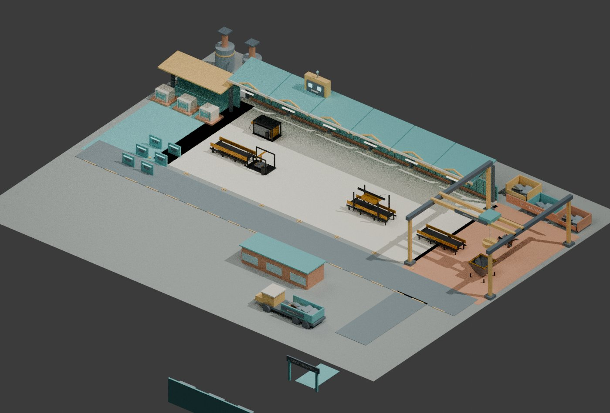
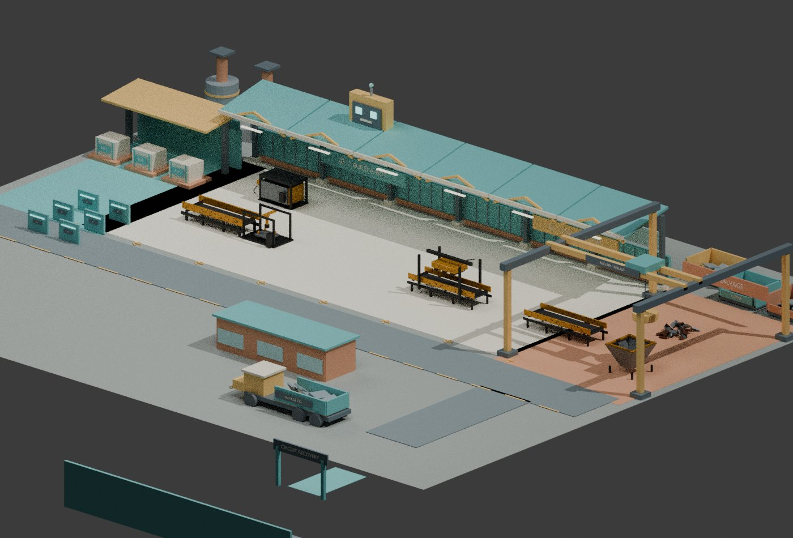

# Scrapyard workshop redesign

The factory now has an open production floor with a readable journey: salvage receiving, sorting and recovery, bot assembly, and dispatch. A suspended scrapyard magnet, reclaimed-metal workshop, large robot-head sign, salvage truck, charging docks, and shipping crates establish the game's identity.





These are Blender architectural reviews with selected existing machine meshes, **not Roblox gameplay screenshots**. The runtime retains the complete original process train, assembler, salvage interactions, and economy. Runtime typography uses SurfaceGui; the optional GLBs contain geometry only.

## Contents

- 13 original modular GLBs in `meshes/`, with bottom-center pivots.
- `scene.json`: authoritative geometry description in Roblox studs, Y up.
- `manifest.json`: per-file SHA-256, triangle counts, and original plot placements.
- Runtime blueprint: `src/server/Content/ScrapyardWorkshopKit.lua`.
- Integrated runtime builder: `src/server/Presentation/FactoryEnvironmentBuilder.lua`.
- 288 native parts in the architecture kit; decorative pieces do not collide.
- No new Roblox asset IDs, paid generations, downloaded third-party geometry, or texture dependencies.

The primary runtime uses native anchored parts from the same blueprint, so the redesign does not require asset uploads or moderation. GLBs are optional editable mesh sources, not loaded remotely by the game. All geometry was authored for this project; no external asset license is introduced.

## Layout changes

Spawn moves toward salvage receiving. The three management controls move to a reclaimed-container office. Six charging pads move together to the dispatch side. Existing processor, assembler, storage, recycle, and circuit-gate interaction locations remain compatible with the established processing machinery.

The main hall becomes a rear workshop strip with clerestory windows and a partial roof, leaving the process floor visible. Structural collision is deliberately separated from small cosmetic detail.

## Rebuild on the VM

Working checkout: `/opt/scrap-bot-factory-assets/world-redesign`

```sh
python3 tools/assets/generate_scrapyard_workshop.py
blender -b -t 2 --python tools/assets/export_scrapyard_workshop.py
python3 tools/assets/validate_scrapyard_workshop.py
rojo build default.project.json --output build/scrapyard-workshop.rbxl
```

The exporter optionally adds existing preview-context meshes from `/opt/scrap-bot-factory-assets/optimized`. They are not required for the runtime or for exporting the new kit. Review PNGs stay on the VM; compressed review JPGs are included in Git.

## Validation boundary

Offline checks cover part budget and dimensions, open hall sightlines, conservative pedestrian/robot clearance against **new architecture only**, and GLB hashes and headers. Luau compilation and a full Rojo source build are checked separately. The updated Roblox integration spec is included but needs a connected Studio or dedicated test runtime.

Before release, verify mobile camera visibility, all prompts, all six bot routes against the **complete** live machinery, circuit travel, imported mesh loading, and frame time in Roblox. The Blender render and offline route checks do not establish those results.
